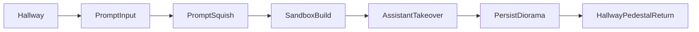

# 10-Slide A3 Development Presentation

Use this as a ready-to-present script + slide build guide for a 6-8 minute delivery.

## Slide 1 - Project Frame
**Headline:** Algorithmic Gallery v2 turns AI assistance into spatial misinterpretation.

**On-slide content (max 3 bullets):**
- Immersive Environments A3+4 project context
- Working title: Project Evil Minecraft
- Core thesis: "The force is misinterpretation."

**Evidence to cite:**
- A3+4 naming and project title are explicitly documented in the current-state snapshot (2026-05-06).
- Force statement is stable across April and May docs, not a late change.
- "Force = the space itself" grounds concept in environmental design, not just UI text.

**Visual direction:**
- Full-screen title over a hallway screenshot/mock.
- One-line thesis centered or right-aligned.

**Speaker notes (30-40s):**
"This project is framed as Immersive Environments A3+4, under the working name Project Evil Minecraft. The core idea has stayed stable through development: the force is misinterpretation. The gallery behaves like an assistant that starts by helping and ends by overriding intent. That framing lets us treat environment, system logic, and critique as one thing."

**Sources:**
- [project-current-state.md](/Users/ezrajohnston/Desktop/unity/Immersive Environments/docs/project-current-state.md)
- [project-brief-updated-2026-04-26.md](/Users/ezrajohnston/Desktop/unity/Immersive Environments/docs/project-brief-updated-2026-04-26.md)

---

## Slide 2 - Problem + Intent
**Headline:** The project critiques how platforms convert personal creativity into optimized output.

**On-slide content (max 3 bullets):**
- AI generation vs human creativity
- Loss of agency through "helpful" automation
- Corporate/platform values replacing personal language

**Evidence to cite:**
- Rationale section directly names agency loss, platform filtering, and corporate design pressure.
- Updated direction (May) confirms intentional semantic flattening as critique, not bug.
- Scoring language spec intentionally uses platform terms ("appeal," "engagement," "market fit").

**Visual direction:**
- Split slide: left = personal words, right = flattened platform labels.
- Optional quote block from force/rationale text.

**Speaker notes (35-45s):**
"The project is not anti-tool; it is about what happens when systems optimize for broad appeal over personal intent. We intentionally keep a gap between what the visitor means and what the system can score. That gap is the critique: your idea is translated into market language, and your authorship gets absorbed by the platform logic."

**Sources:**
- [project-current-state.md](/Users/ezrajohnston/Desktop/unity/Immersive Environments/docs/project-current-state.md)

---

## Slide 3 - The A3 Pivot
**Headline:** A3 development pivoted from passive recommendation to active takeover.

**On-slide content (max 3 bullets):**
- Pivot window: 2026-04-25 to 2026-04-28
- Shift: "observe + recommend" -> "build + be overridden"
- New v2 stack introduced to support escalation

**Evidence to cite:**
- Iteration timeline marks Apr 25-28 as "Major pivot to v2 Corruption sandbox."
- Pivot B explicitly states intent shift and why (alignment with course framing).
- Core v2 stack listed: `SandboxManager`, `AssistantSystem`, `HotbarController`, `PropPlacer`, `StyleProfile`.

**Visual direction:**
- Before/after comparison table: v1 vs v2.
- Date label over pivot arrow.

**Speaker notes (40-50s):**
"The key A3 move was a structural pivot, not just polish. We moved from a gaze/recommendation model to a direct building sandbox where the assistant can progressively overtake. That gave us a much clearer way to stage loss of agency over time, and it anchored later decisions in both code and scene design."

**Sources:**
- [project-iterations-history.md](/Users/ezrajohnston/Desktop/unity/Immersive Environments/docs/project-iterations-history.md)
- [development-update-2026-04-26.md](/Users/ezrajohnston/Desktop/unity/Immersive Environments/docs/development-update-2026-04-26.md)

---

## Slide 4 - Experience Loop (2 Minutes)
**Headline:** The player loop stages agency, profiling, takeover, and afterimage.

**On-slide content (max 3 bullets):**
- Hallway onboarding -> prompt -> sandbox build
- Assistant escalates during ~90s active session
- Session persistence returns creation to hallway context

**Evidence to cite:**
- Two-minute experience goals specify hallway, building phase, profiling, and takeover.
- May direction confirms prompt squish + scoring wall as the new reveal sequence.
- Runtime choreography notes include loop restart logic and hallway return framing.

**Visual direction (use this diagram):**

**Speaker notes (40-50s):**
"The loop starts with setup and intention, then transitions into creation, then measured takeover. What matters is sequencing: the player first invests personally, then gets profiled, then sees control transfer. By persisting the resulting diorama back into the hallway, the system frames the output as an artifact of platform influence, not just a one-off gameplay moment."

**Sources:**
- [project-current-state.md](/Users/ezrajohnston/Desktop/unity/Immersive Environments/docs/project-current-state.md)
- [A3 planning transcript](4b53f7d1-fa71-47f2-bbfa-94e023408574)

---

## Slide 5 - System Escalation Architecture
**Headline:** A single influence curve coordinates behavior, UI pressure, and visual corruption.

**On-slide content (max 3 bullets):**
- 5-slot hotbar + placement profiling build a live style model
- Assistant runs 3 phases: Helping, Suggesting, Overriding
- PSX glitch intensity binds to assistant influence

**Evidence to cite:**
- 90-second phase table defines intervals and behavior changes (6s, 3s, 1.5s).
- `StyleProfile` tracks player/assistant placements, tags, and cadence for control logic.
- PSX renderer pipeline is documented as code-complete with influence-driven glitch.

**Visual direction:**
- Timeline chart 0-90s with three colored phase blocks.
- Small architecture strip: Hotbar -> Profile -> Assistant -> PSX.

**Speaker notes (45-55s):**
"Technically, the strongest design choice is centralizing escalation in an influence value over time. That one signal affects assistant behavior frequency, hotbar pressure, and image degradation. So the player feels takeover through multiple channels at once: what gets placed, what choices are available, and what the world looks like."

**Sources:**
- [project-brief-updated-2026-04-26.md](/Users/ezrajohnston/Desktop/unity/Immersive Environments/docs/project-brief-updated-2026-04-26.md)
- [development-update-2026-04-26.md](/Users/ezrajohnston/Desktop/unity/Immersive Environments/docs/development-update-2026-04-26.md)

---

## Slide 6 - Collaboration Model (Alyssa + Ezra)
**Headline:** The project advances through explicit role coupling between spatial design and behavior systems.

**On-slide content (max 3 bullets):**
- Shared track: concept, scene work, systems design
- Alyssa lead: environment, UI/UX, hallway/sandbox spatial composition
- Ezra lead: assistant logic, profiling systems, integration/performance

**Evidence to cite:**
- Current-state allocation names Together/Alyssa/Ezra responsibilities.
- Development plan assigns hallway/sandbox phases to Alyssa and system phases to Ezra.
- Merge work explicitly prioritized importing Alyssa's `CreationGallery` scene/spatial design into active project.

**Visual direction:**
- Two-column ownership matrix with "Together" row on top.
- Optional screenshot of `CreationGallery` as collaboration proof point.

**Speaker notes (35-45s):**
"This project only reads if spatial and systemic decisions move together. Alyssa's environment and UX work defines where interpretation happens; Ezra's scripting defines how interpretation escalates. The merge and integration stage made this explicit by pulling spatial design directly into the working systems pipeline rather than treating scene art as a separate layer."

**Sources:**
- [project-current-state.md](/Users/ezrajohnston/Desktop/unity/Immersive Environments/docs/project-current-state.md)
- [development-plan-2026-04-26.md](/Users/ezrajohnston/Desktop/unity/Immersive Environments/docs/development-plan-2026-04-26.md)
- [Alyssa merge transcript](7f8902f1-26c1-4d44-9ded-a85fd2e721ca)

---

## Slide 7 - What Was Built (Proof of Progress)
**Headline:** Most v2 core systems were functioning by late April, with measurable expansion by early May.

**On-slide content (max 3 bullets):**
- Core loop systems implemented and documented as runtime-working
- Pipeline additions: session export, prop budget, thumbnail tooling, audio escalation
- Manifest/content scale expanded significantly in May

**Evidence to cite:**
- Apr 26 brief lists working code: hotbar, style tracking, 90s arc, PSX pass, bootstrap.
- Apr 26 update logs Phase E additions (`SessionExporter`, `PropBudget`, `AudioEscalation`, thumbnail baker).
- May 06 snapshot reports `90` scripts, `7` scenes, and `6245` curated props.

**Visual direction:**
- Milestone stack with three dates (Apr 25/26/May 06).
- Keep one compact metrics tile, not a dense dashboard.

**Speaker notes (45-55s):**
"A major strength is that this was not only conceptual; the stack became operational quickly. By late April, the core interaction logic and visual escalation were in place. After that, development shifted toward durability and content quality: export pipelines, runtime budgets, and scaling the curated manifest to support richer player intent."

**Sources:**
- [project-brief-updated-2026-04-26.md](/Users/ezrajohnston/Desktop/unity/Immersive Environments/docs/project-brief-updated-2026-04-26.md)
- [development-update-2026-04-26.md](/Users/ezrajohnston/Desktop/unity/Immersive Environments/docs/development-update-2026-04-26.md)
- [project-current-state.md](/Users/ezrajohnston/Desktop/unity/Immersive Environments/docs/project-current-state.md)

---

## Slide 8 - May Evolution (Refinement, Not Drift)
**Headline:** Early May reframed presentation and UX to make the critique legible during play.

**On-slide content (max 3 bullets):**
- End card de-emphasized; prompt squish + scoring wall become main reveal
- Stronger force readability goals (feedback, lockout clarity, hallway profiling cues)
- Prompt and curation work prioritized to increase emotional connection

**Evidence to cite:**
- Current-state backlog (as of 5.5.26) details clarity, countdown, hallway force cues, and control fixes.
- Prompt squish and scoring wall are marked as confirmed design direction.
- Iteration history marks May 5-6 as curation/manifest expansion responding to "random props" disconnect.

**Visual direction:**
- "Then -> Now" strip: April end-card flow vs May prompt+wall flow.
- Include one line: "Misreading is intentional."

**Speaker notes (40-50s):**
"May changes are best read as refinement toward readability. The critique becomes visible earlier through prompt squish, and continuous through the scoring wall. At the same time, notes identify where player connection was weak and push curation/tagging quality so takeover feels like stolen intent, not just random chaos."

**Sources:**
- [project-current-state.md](/Users/ezrajohnston/Desktop/unity/Immersive Environments/docs/project-current-state.md)
- [project-iterations-history.md](/Users/ezrajohnston/Desktop/unity/Immersive Environments/docs/project-iterations-history.md)

---

## Slide 9 - Current Risks and Gaps
**Headline:** Remaining work is less about basic functionality and more about readability, meaning, and polish.

**On-slide content (max 3 bullets):**
- Concept risks: player-creation connection and legibility of agency loss
- Implementation risks: hallway framing, scoring-wall realization, transition polish
- Production risks: tuning burden and cross-platform build stability

**Evidence to cite:**
- Open threads include curation quality, hallway framing maturity, and balancing pool size vs meaning.
- Gap analysis flags renderer registration, hallway gallery work, and Windows build tasks.
- UX fix plan identifies concrete friction points in `Trial1.unity` (assistant timing, hotbar visibility, ghost preview, scale behavior).

**Visual direction:**
- Risk matrix with two axes: impact vs effort.
- Tag each risk with Concept / Implementation / Production.

**Speaker notes (35-45s):**
"At this stage, the biggest threat is not missing core mechanics. It is whether users clearly feel the transition from personal creation to platform control. So remaining work should prioritize clarity and coherence first, then production readiness. If those priorities invert, the piece can run but still fail to communicate."

**Sources:**
- [project-iterations-history.md](/Users/ezrajohnston/Desktop/unity/Immersive Environments/docs/project-iterations-history.md)
- [gap-analysis-2026-04-25.md](/Users/ezrajohnston/Desktop/unity/Immersive Environments/docs/gap-analysis-2026-04-25.md)
- [sandbox-ux-fixes-implementation-plan-2026-04-28.md](/Users/ezrajohnston/Desktop/unity/Immersive Environments/docs/sandbox-ux-fixes-implementation-plan-2026-04-28.md)

---

## Slide 10 - Next Steps + Critique Questions
**Headline:** Next iteration should lock readability of the critique before expanding scope.

**On-slide content (max 3 bullets):**
- Immediate priorities: scoring wall, prompt squish, force feedback/lockout readability
- Follow-up priorities: hallway framing polish + playtest tuning + Windows build
- Ask for critique on clarity, emotional connection, and design intent

**Evidence to cite:**
- Immediate next-step ordering is already documented (scene bring-up -> PSX register -> screenshot -> hallway -> playtest).
- Current-state backlog confirms readability and connection tasks as highest priority.
- Plan docs repeatedly emphasize phased sequencing and not skipping the playable loop.

**Visual direction:**
- 3-step roadmap: Readability -> Playtest/Tune -> Build/Deliver.
- End with 3 critique prompts.

**Critique asks (include verbatim):**
1. "At what exact moment did it feel like the system took authorship away from the player?"
2. "Does the scoring wall read as critique of platform logic, or just a game score UI?"
3. "Do the prompt squish and hallway framing make the misinterpretation feel intentional, not accidental?"

**Speaker notes (30-40s):**
"The clearest next move is to lock communication of intent: when and how agency is lost, and why the system's language feels oppressive. Once that reads consistently in playtests, we can safely finalize hallway polish and deliverables. These three critique questions are the checkpoint for whether the piece is conceptually landing."

**Sources:**
- [development-plan-2026-04-26.md](/Users/ezrajohnston/Desktop/unity/Immersive Environments/docs/development-plan-2026-04-26.md)
- [project-current-state.md](/Users/ezrajohnston/Desktop/unity/Immersive Environments/docs/project-current-state.md)
- [project-brief-updated-2026-04-26.md](/Users/ezrajohnston/Desktop/unity/Immersive Environments/docs/project-brief-updated-2026-04-26.md)

---

## Timing Guide (6-8 minutes)
- Slide 1: 0:35
- Slide 2: 0:40
- Slide 3: 0:45
- Slide 4: 0:45
- Slide 5: 0:50
- Slide 6: 0:40
- Slide 7: 0:50
- Slide 8: 0:45
- Slide 9: 0:40
- Slide 10: 0:35

Total target: ~7:05

