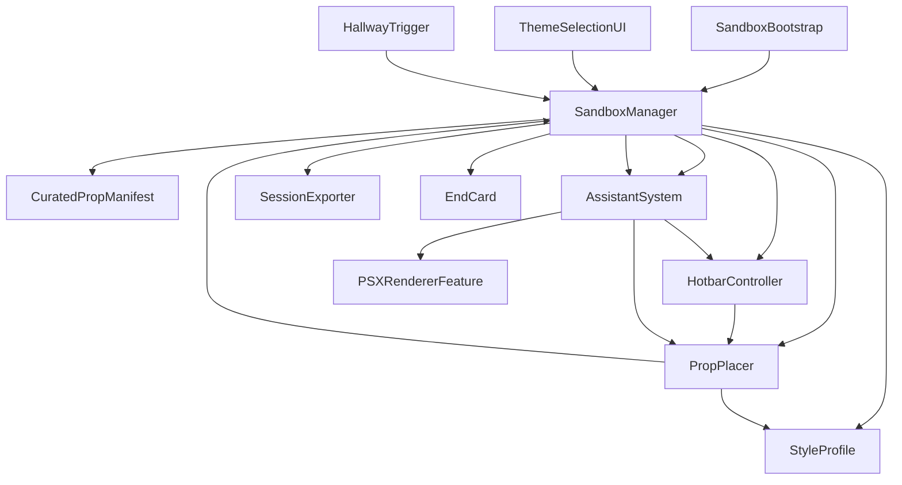
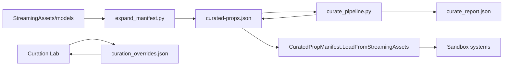

# Immersive Environments — Current State Reference

Last updated: 2026-05-06

## 1) Project Snapshot

This project is a Unity-based interactive artwork/game prototype centered on AI-assisted environmental composition.

- Unit/brief naming in-class: **Immersive Environments A3+4 — Algorithmic Gallery v2**.
- Working project name: **Project Evil Minecraft** (Voima/Lucid Blocks-inspired: familiar building language, corrupted by system misreading).

- Engine: Unity + URP (`com.unity.render-pipelines.universal` 17.3.0)
- Runtime content pipeline: GLB via GLTFast (`com.unity.cloud.gltfast` 6.18.0)
- Main logic language: C# (`Assets/scripts`)
- Offline data tooling: Python scripts at repo root
- Current curated prop manifest: `Assets/StreamingAssets/curated-props.json`
- Sandbox may load a **game-ready subset** (`curated-props.game-ready.json`); see `docs/game-ready-manifest.md`.

Current measurable state:

- `90` C# scripts under `Assets/scripts`
- `7` Unity scenes under `Assets/Scenes`
- `5` Python tooling scripts at repo root
- `15` markdown docs under `docs`
- `21800` GLB files under `Assets/StreamingAssets/models`
- `6245` props currently in `curated-props.json`
- Current size distribution: `tiny=26`, `small=248`, `medium=1547`, `large=4424`, `oversized=0`

## 2) Concept and Experience (v2)

### Force description

**The force is misinterpretation.** It corrupts creative intent by behaving as an “assistant” that tracks the visitor’s behaviour to build a profile of them. That profile is used to “help” the visitor build their creation. Over time, the force oversteps its influence and produces wild generations based on the visitor’s initial creation.

In the logic of the world: **the force is the space itself** (the gallery).

### Related docs

- Brief and current framing: `docs/project-brief-updated-2026-04-26.md`
- Iteration history and timeline: `docs/project-iterations-history.md`

### Two-minute experience goal

- The visitor begins in a gallery hallway, approaches the sandbox area, and is encouraged to create through **diegetic spatial elements**.
- The visitor begins building by placing props.
- The system analyses building style (placement patterns, props used) to build a profile.
- The assistant launches and begins placing props alongside the player.
- Over ~90 seconds of playtime the assistant increasingly oversteps and fills the space, reducing the player’s creative input.
- End state: the piece should make it **obvious** the player has lost agency.
- At the end, the system **saves the visitor’s built diorama** and (on the next run) **presents it in the hallway** on a previously empty pedestal.

### Behaviour blocks (conceptual)

- **Visitor begins experience**
- **Visitor walks toward sandbox area**
- **Visitor is encouraged to begin creating** (given props to place)
- **Placing props**
- **System analysing visitor** and building a profile
- **System assisting** by placing props
- **System overtaking** the visitor’s agency

### Rationale / themes

- Loss of agency; “help” becomes replacement.
- The world encourages you to create, but not fully on your terms.
- AI generation vs human creativity; good potential use that fails users in execution.
- The end result is technically player-made (they laid the seeds) but they get none of the satisfaction of the complete process.
- Platforms affecting the creations of their users.
- Corporate design pressure: management control, trend following, generalized consumer appeal.

### Conceptual touchstones / inspirations

- Voima / Lucid Blocks: “strange Minecraft versions” — established, comfortable cultural framework corrupted to unsettle.
- PSX visual style (shaders, dithering): Lethal Company, Mouthwashing.
- Katamari Damacy.

### Work allocation (current intent)

- **Together**: conceptualising, Unity scene work, systems design.
- **Alyssa**: UI/UX, 3D model, spatial sketches/grayboxing.
- **Ezra**: scripting algorithm for growth/behaviour tracking, video work; tooling for prop filtering/curation.

### Credits / references

- PSX filtering base: `https://github.com/Math-Man/URP-PSX-FORKED` (credit reference)
- Models/prop database reference: `https://github.com/hisprofile/blenderstuff/blob/main/Creations/Source%20Engine%20Blender%20Collection.md`
- AI used for scripting/planning (tools used): Claude (Opus/Sonnet), Cursor models, Gemini, Deepseek (as noted in working doc)

## 2) Repository Map (All Top-Level Folders/Files)

### Root

- `Assets`: all Unity content (scripts, scenes, models, materials, shaders, StreamingAssets, prefabs)
- `Packages`: package manifest/lock and package dependencies
- `ProjectSettings`: Unity project configuration
- `UserSettings`: user-local Unity editor settings
- `Library`: generated Unity cache/build intermediates
- `Logs`: Unity logs
- `.git`, `.vscode`, `.claude`: repo/editor/assistant config
- `Assembly-CSharp*.csproj`, `Immersive Environments.slnx`: IDE solution/project files
- `curate_pipeline.py`: main validation/enrichment pipeline for manifest
- `expand_manifest.py`: bulk ingestion script from model pool into manifest
- `remove_oversized_from_manifest.py`: cleanup script removing `oversized` entries
- `generate_vocabulary.py`: vocabulary generation tooling
- `validate_vocabulary.py`: vocabulary validation tooling
- `curate_report.json`: latest pipeline run output (summary + removal reasons)
- `docs`: authored project documentation

### `Assets` (first-level inventory)

- `scripts`: primary source code (active v2 + legacy v1 + editor utility)
- `Scenes`: Unity scenes (`SampleScene`, `CreationGallery`, `HallToSandbox_Sculptures`, `Psx_*`)
- `StreamingAssets`: runtime data (`curated-props.json`, `metadata.json`, `vocabulary.json`, `models`, `seed_sessions`)
- `Shaders`: shader code including PSX post shader
- `Subgraphs`: Shader Graph subgraphs
- `Settings`: render and lighting configuration assets
- `Gallery`: scene assets related to gallery environments
- `Materials`: material assets
- `Models`: model/prefab assets
- `SUPER Character Controller`: third-party character controller package content
- `TutorialInfo`: Unity tutorial/template artifacts
- `assets`: additional imported content folder (lowercase path)
- Root-level assets/prefabs/fonts: URP-PSX assets, prefabs, `.ttf`, `.mat`, audio clips, etc.

### `Assets/StreamingAssets`

- `curated-props.json`: canonical prop manifest consumed by runtime systems
- `metadata.json`: broader source metadata corpus used by tooling
- `vocabulary.json`: text/vocabulary mapping used by prompt parsing
- `models/`: full GLB corpus (21800 files)
- `seed_sessions/`: fallback hallway/session seed content
- `curation_overrides.json`: optional runtime-generated curation overlay (created by curation lab on save)

## 3) Active Runtime Architecture (v2 Corruption)

Core active namespace is `AlgorithmicGallery.Corruption`.

## 3.5) Active Backlog (as of 2026-05-05)

This section captures current priorities and design notes as of 5.5.26. It is intentionally separated from the “current implementation” sections below.

### Player feedback and readability

- **System placement feedback**: more feedback when the system places objects (glitching into existence, VFX emphasis).
- **Loss-of-agency clarity**: make it obvious when the player loses ability to build.
- **Countdown**: start a clock/ticking cue **10 seconds before** build ability is removed.
- **Ending readability**: reformat the ending; remove the darkness overlay.

### Hallway and force presence

- **Force representation**: some explicit “force representation” in the hallway; shorten hallway.
- **Profiling cues**: some form of being profiled in hallway (e.g. light flickering when looking at dioramas).
- **Door/attention direction**:
  - open door to hallway + door opening sound to call player over
  - door should not close while the player is not in the sandbox room

### Prompting and creative connection (highest priority)

- **Prompt copy**:
  - new prompt: “What space will you build?”
  - slightly smaller text: “Choose something meaningful.”
- **Player connection to creation**: current “placing random props” is not effective. Connection should be achieved through:
  - better prop filtering and distribution
  - more semantic tagging
  - more groups
  - manual curation workflow

**Design intent — intentional misinterpretation:** The prompt→tag pipeline is intentionally imprecise. The system will make a best effort to map the visitor’s text to relevant prop categories, but semantic gaps and category flattening are **by design, not a failure**. The point is not accuracy — it is the demonstration that a system built on consumer-appeal optimisation cannot faithfully receive a specific, personal creative intent. The misreading *is* the critique. A visitor typing “my grandmother’s living room” and receiving `domestic, furniture, item` is experiencing exactly what the piece is about. This should not be “fixed” to the point of erasing that gap.

**Prompt squish animation (replaces end card):** Immediately after the visitor submits their prompt, an animation plays before the sandbox opens — showing their full typed text visibly compressed and filtered down into 3 vague platform-style category labels. This animation is the first act of reduction. The visitor watches their specific, personal intent get processed and flattened in real time. The end card has been **removed** in favour of this front-loaded reveal and the in-sandbox scoring wall (see Scoring Wall below).

### Ending and transition choreography

**End card removed.** The experience no longer ends with a text end card. The critical reveal is front-loaded into the prompt squish animation (see above) and runs continuously through the scoring wall (see below). There is no discrete “end screen.”

- The built diorama is **persisted** and later shown on a hallway pedestal on the next run (replacing the earlier screenshot concept).
- The session ends when the session timer expires; the space simply stops, leaving the visitor with what was built and what the scoring wall now shows.

### Controls and UX fixes

- Remove jump.
- Remove sprint.
- Fix moving while build terminal / prompt UI is open.

### Visual tuning

- Remove fog from shader or make it brighter.

### Scoring wall (confirmed scope)

**Status:** confirmed design direction, not a prototype candidate.

A wall in the sandbox room shows the visitor’s creation scored in real time across two sets of categories:

**Personal/expressive dimensions** (seeded from the visitor’s prompt — e.g. `calm`, `nostalgic`, `intimate`, `playful`): These reflect the visitor’s stated intent. They may start at some value and are broadly ignored by the system’s optimisation logic.

**Platform/corporate dimensions** (fixed, system-defined — e.g. `consumer appeal`, `engagement potential`, `market fit`, `trending`): These are what the assistant is actually optimising for. The system only places props that move these metrics.

**The key mechanic:** as the assistant takes over, the corporate dimension bars grow while the personal dimension labels are progressively erased from the wall — not just reduced, but literally removed. By the end of the session, only the corporate metrics remain visible. The visitor’s vocabulary has been replaced by the system’s.

**Scoring language is the critique.** The wall does not use neutral game language. It uses deliberate platform vocabulary: “projected engagement,” “appeal index,” “consumer reach.” The visitor does not need a wall label to understand what is being critiqued — the words do it.

**Sequencing note:** The score should not be present when the visitor first enters the sandbox. It should appear once the assistant begins placing — as if the system has decided the creation is now worth measuring. This preserves a window of unscored creative investment before the platform’s logic intrudes.

**Competition layer (optional / leaderboard):** A leaderboard of previous visitors’ scores (seeded/fabricated) where all high-ranking entries have converged on nearly identical platform-dimension profiles. The argument is visual: to score well, everyone builds the same thing.

## 3.6) Changes Yet To Be Made (consolidated)

This section consolidates planned changes pulled from the backlog above plus the latest direction notes.

### Spatial / placement constraints

- **Smaller build platform**: alter model sizing and placement assumptions to fit a smaller, raised platform (e.g. ~10×10) instead of the current larger floor area.
- **Placement bounds**: only allow placement **on the provided platform** (no placing elsewhere in the room).
- **No stacking/overlap**: prevent models being placed on top of each other; enforce collision/spacing rules so props cannot interpenetrate or stack unrealistically.

### Player connection and meaning

- **Primary objective**: ensure player feels connected to what they’re building (avoid “random props” feeling).
- **Content work**: improve semantic tagging, prop distribution, and grouping; continue manual curation.
- **Scoring wall** (confirmed): build the in-sandbox scoring wall showing personal dimensions (from prompt) vs platform/corporate dimensions (system-optimised). Personal labels are progressively erased as the session proceeds. See scoring wall design note in section 3.5.
- **Prompt squish animation** (confirmed): replace end card with a prompt-compression animation immediately after prompt submission. Visitor watches their text flattened into 3 platform-style category labels before the sandbox opens.

### Readability and force presence

- Add stronger feedback when the system places objects (VFX/glitch “spawning into existence”).
- Make loss-of-control more legible (explicit lockout moment + 10-second warning).
- Hallway changes: clearer force representation, profiling cues while viewing dioramas, shorten hallway, adjust door behavior/sound cues.

### Ending and transitions

- **End card removed.** Do not implement or restore the text end card.
- Implement prompt squish animation in the prompt/intake flow (before sandbox entry).
- Implement scoring wall in sandbox room (personal dimension labels erasing as session progresses).
- Diorama persists and appears on hallway pedestal on next run.
- Remove darkness overlay from session end.

### Controls and UX

- Remove jump and sprint.
- Prevent movement while terminal/prompt UI is open.

### Visual tuning

- Adjust fog/shader brightness (remove fog or make brighter).

### Runtime Flow

### System Roles

- `SandboxBootstrap.cs`: one-component startup entry; guarantees a `SandboxManager`
- `SandboxManager.cs`: orchestrator (manifest load, dependency bootstrap, prompt flow, activation, timer, completion)
- `CuratedPropManifest.cs`: loads/indexes `curated-props.json`, exposes weighted/random retrieval
- `HotbarController.cs` + `HotbarUI.cs`: 5-slot user prop selection and display
- `PropPlacer.cs`: floor placement + preview + spacing logic
- `AssistantSystem.cs`: escalating influence and autonomous/reactive intervention
- `StyleProfile.cs`: records placement behavior and aggregate profile
- `SessionExporter.cs`: writes session artifacts for review/replay
- `EndCard.cs`: end-of-session reflection UI
- `PSXRendererFeature.cs` + `PSXPass.cs` + `Assets/Shaders/PSXPost.shader`: image degradation/escalation visual language

## 4) Data and Tooling Pipeline

- `expand_manifest.py`: candidate discovery + skip rules + metadata defaults + insertion
- `curate_pipeline.py`: GLB validation, dimension extraction, size/confidence assignment, hard-removals
- `remove_oversized_from_manifest.py`: explicit post-pass if oversized entries must be eliminated
- `curation_overrides.json`: curation lab modifications (group/tag/scale/notes), stored separately from base manifest

## 5) Scenes and Build State

- Build settings currently include only `Assets/Scenes/SampleScene.unity`
- Other available scenes:
  - `Assets/Scenes/CreationGallery.unity`
  - `Assets/Scenes/HallToSandbox_Sculptures.unity`
  - `Assets/Scenes/Psx_PBR.unity`
  - `Assets/Scenes/Psx_Unlit.unity`
  - `Assets/Scenes/Psx_Unlit_Variant.unity`
  - `Assets/Scenes/Psx_Unlit_Variant_PolyBrush.unity`

## 6) Script Inventory (Comprehensive)

All scripts under `Assets/scripts` are listed below by subsystem (includes legacy files retained in-repo).

### Orchestration and Core Loop

- `Assets/scripts/SandboxBootstrap.cs`: bootstrap entry point for v2 runtime
- `Assets/scripts/SandboxManager.cs`: central session coordinator
- `Assets/scripts/IntakeRoomGateController.cs`: intake gating and flow control
- `Assets/scripts/HallwayTrigger.cs`: trigger-based transition into sandbox
- `Assets/scripts/HallwayManager.cs`: hallway session/diorama content loading
- `Assets/scripts/HallwayDioramaPedestal.cs`: per-pedestal hallway behavior

### Placement, Profile, and Session

- `Assets/scripts/PropPlacer.cs`: placement interaction and anti-overlap
- `Assets/scripts/PropScaler.cs`: prop scale adjustment support
- `Assets/scripts/StyleProfile.cs`: placement profile/statistics model
- `Assets/scripts/StyleProfileGizmo.cs`: scene gizmo visualization for profile density
- `Assets/scripts/SessionExporter.cs`: session persistence/export
- `Assets/scripts/PropBudget.cs`: cap and eviction policy for active props
- `Assets/scripts/PropPool.cs`: optional prewarm/loading pool
- `Assets/scripts/SculptureSpawner.cs`: GLB loading/instantiation
- `Assets/scripts/SculptureController.cs`: sculpture behavior support (legacy/shared)

### Assistant and Prompt Systems

- `Assets/scripts/AssistantSystem.cs`: corruption-phase logic and intervention
- `Assets/scripts/AssistantDebugUI.cs`: debug UI
- `Assets/scripts/ThemeSelectionUI.cs`: prompt input/selection UI
- `Assets/scripts/ThemeConfig.cs`: prompt/theme config definitions
- `Assets/scripts/PromptParser.cs`: text prompt parsing into intent/tags
- `Assets/scripts/PromptToolResolver.cs`: intent-to-prop seeding logic
- `Assets/scripts/PromptMoodLighting.cs`: prompt-driven lighting shifts
- `Assets/scripts/PromptTerminalTrigger.cs`: prompt terminal interaction hook
- `Assets/scripts/ProfileTerminalDisplay.cs`: profile output display
- `Assets/scripts/VocabularyDictionary.cs`: vocabulary lookup/dictionary layer

### Hotbar and UI Utilities

- `Assets/scripts/HotbarController.cs`: slot state and reroll logic
- `Assets/scripts/HotbarUI.cs`: runtime hotbar canvas
- `Assets/scripts/UiFontResolver.cs`: runtime font resolution helper
- `Assets/scripts/EndCard.cs`: end-session UI card
- `Assets/scripts/RuntimeThumbnailCapture.cs`: thumbnail rendering/caching
- `Assets/scripts/Editor/ThumbnailBaker.cs`: editor thumbnail bake tool

### Audio and VFX

- `Assets/scripts/SandboxSfx.cs`: sandbox sound orchestration
- `Assets/scripts/PlacementSoundLibrary.cs`: placement sound catalog
- `Assets/scripts/AudioEscalation.cs`: influence-driven audio escalation
- `Assets/scripts/EchoFeedback.cs`: feedback layer tied to interactions
- `Assets/scripts/SandboxReactiveVfxDirector.cs`: VFX director for sandbox states
- `Assets/scripts/EnvironmentFXManager.cs`: environment-level FX control
- `Assets/scripts/PhaseVolumeController.cs`: volume control by session phase

### Rendering Features and Post Effects

- `Assets/scripts/PSXRendererFeature.cs`: URP renderer feature
- `Assets/scripts/PSXPass.cs`: PSX render pass implementation
- `Assets/scripts/GlitchRendererFeature.cs`: separate glitch renderer feature
- `Assets/scripts/GlitchPass.cs`: glitch pass implementation
- `Assets/scripts/Fog/Fog.cs`
- `Assets/scripts/Fog/FogController.cs`
- `Assets/scripts/Fog/FogRenderFeature.cs`
- `Assets/scripts/Dithering/Dithering.cs`
- `Assets/scripts/Dithering/DitheringController.cs`
- `Assets/scripts/Dithering/DitheringRenderFeature.cs`
- `Assets/scripts/Pixelation/Pixelation.cs`
- `Assets/scripts/Pixelation/PixelationController.cs`
- `Assets/scripts/Pixelation/PixelationRenderFeature.cs`
- `Assets/scripts/CRT/Crt.cs`
- `Assets/scripts/CRT/CRTEffectController.cs`
- `Assets/scripts/CRT/CRTRenderFeature.cs`

### Movement and Player

- `Assets/scripts/SimplePlayerRig.cs`: self-contained FPS rig
- `Assets/scripts/PlayerMovement.cs`: alternate/basic movement component

### Curation Tooling

- `Assets/scripts/CurationLabBootstrap.cs`: auto-setup for curation scene
- `Assets/scripts/CurationManager.cs`: curation state + queues + operations
- `Assets/scripts/CurationUI.cs`: runtime-built curation interface
- `Assets/scripts/CurationViewport.cs`: isolated render viewport for model review
- `Assets/scripts/CurationOverlay.cs`: overlay data model/load/save/apply

### Legacy Recommendation/Gallery System (`Assets/scripts/_legacy`)

- `Assets/scripts/_legacy/IGazeProvider.cs`
- `Assets/scripts/_legacy/DesktopGazeProvider.cs`
- `Assets/scripts/_legacy/VRGazeProvider.cs`
- `Assets/scripts/_legacy/GazeManager.cs`
- `Assets/scripts/_legacy/IRecommendationStrategy.cs`
- `Assets/scripts/_legacy/ExplorationStrategy.cs`
- `Assets/scripts/_legacy/ExploitationStrategy.cs`
- `Assets/scripts/_legacy/DesperationStrategy.cs`
- `Assets/scripts/_legacy/RecommendationEngine.cs`
- `Assets/scripts/_legacy/RecommendationDebugUI.cs`
- `Assets/scripts/_legacy/GalleryManager.cs`
- `Assets/scripts/_legacy/LinearGalleryController.cs`
- `Assets/scripts/_legacy/LinearRoomTrigger.cs`
- `Assets/scripts/_legacy/RoomRuntime.cs`
- `Assets/scripts/_legacy/RoomDoor.cs`
- `Assets/scripts/_legacy/RoomDoorTrigger.cs`
- `Assets/scripts/_legacy/RoomGalleryBridge.cs`
- `Assets/scripts/_legacy/RoomLoopManager.cs`
- `Assets/scripts/_legacy/LegacyRoomTransitionTrigger.cs`
- `Assets/scripts/_legacy/GrowthPart.cs`
- `Assets/scripts/_legacy/AudioReactiveEmission.cs`
- `Assets/scripts/_legacy/AudioSpectrumAnalyzer.cs`
- `Assets/scripts/_legacy/LightFlickerController.cs`
- `Assets/scripts/_legacy/cubeAppear.cs`
- `Assets/scripts/_legacy/placeBlock.cs`

### Shared Data Models

- `Assets/scripts/ModelEntry.cs`: model metadata container
- `Assets/scripts/MetadataIndex.cs`: metadata indexing/search support
- `Assets/scripts/UserProfile.cs`: user profile model (legacy/shared)
- `Assets/scripts/CuratedPropManifest.cs`: active curated manifest model/index

## 7) Documentation Folder (`docs`) — Current Purpose

- `docs/setup-v2.md`: operational setup guide for v2
- `docs/development-update-2026-04-26.md`: major v2 refactor update
- `docs/development-plan-2026-04-26.md`: plan snapshot for v2 rollout
- `docs/project-brief-updated-2026-04-26.md`: updated project concept/brief
- `docs/gap-analysis-2026-04-25.md`: plan-vs-code audit
- `docs/project-context-2026-04-12.md`: foundational project context
- `docs/development-update-2026-04-12.md`: baseline development update
- `docs/project-context-sandbox-ux-v2-2026-04-28.md`: v2 UX observations
- `docs/sandbox-ux-fixes-implementation-plan-2026-04-28.md`: UX fix plan
- `docs/analysis-terminal-screen-plan-2026-04-28.md`: terminal analysis screen plan
- `docs/psx-reactive-vfx-plan-2026-04-28.md`: PSX VFX plan
- `docs/linear-room-loop-editor-setup-2026-04-16.md`: room-loop editor setup notes
- `docs/room-chain-stabilization-checklist-2026-04-16.md`: stabilization checklist
- `docs/unity-scene-integration-checklist-2026-04-12.md`: integration checklist
- `docs/session-log.md`: append-only dated session index with transcript links

## 8) Current Operational Realities

- The v2 sandbox path is the active architecture; legacy systems remain for reference and fallback experimentation.
- Curation exists in both offline scripts and an in-engine curation lab.
- Manifest now favors floor-placeable non-oversized entries after recent curation operations.
- The model corpus is intentionally much larger than the active manifest, allowing future ingestion passes.

